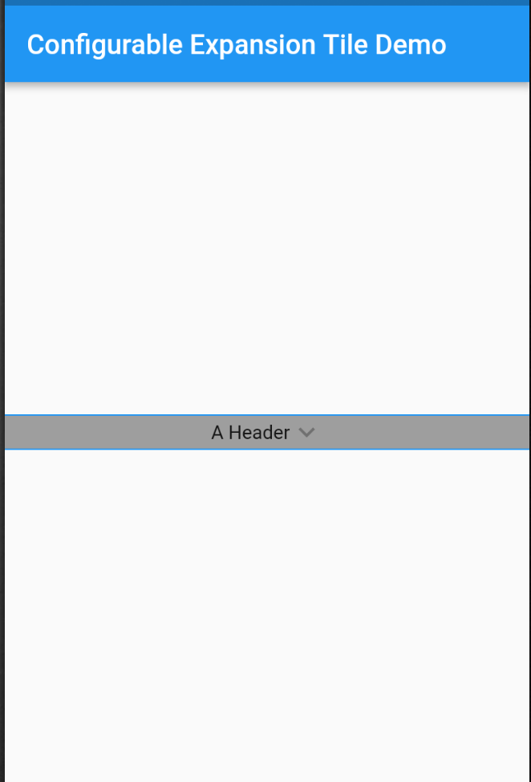
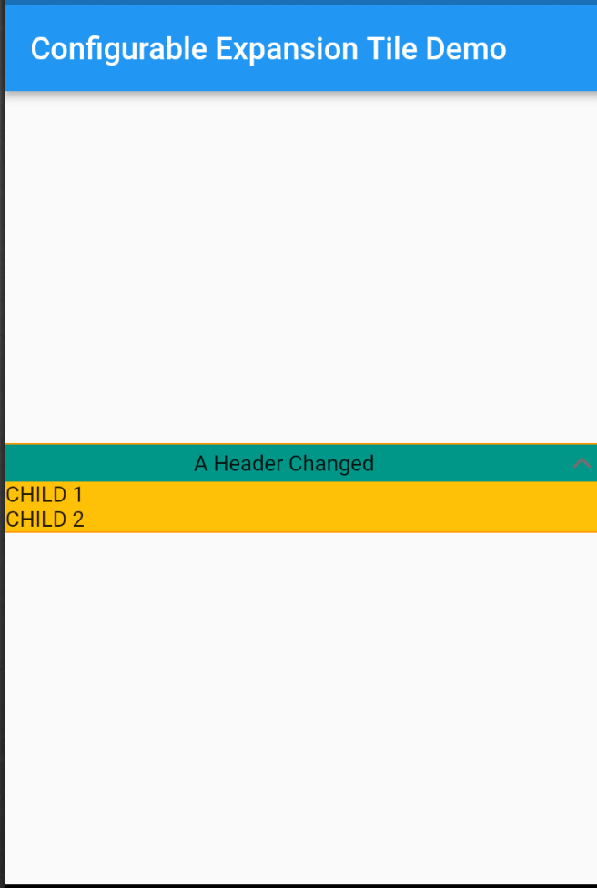

# configurable_expansion_tile

A Configurable Expansion Tile edited from the flutter material implementation
that allows for customization of the internal components. Includes providing colours,
replacement widgets on expansion, and custom animations.

Tile animations still takes place (which are also configurable), and a widget can be set to precede and/or follow the provided header, which will rotate on expand/collapse of the tile.

Configure any or all parameters or leave default behaviour - header works out of the box.

## Installation

In the dependencies: section of your `pubspec.yaml`, add the following line:

```yaml
configurable_expansion_tile: <latest_version>
```

## Usage

```dart
import 'package:configurable_expansion_tile/configurable_expansion_tile.dart';

class MyWidget extends StatelessWidget {
  Widget build(BuildContext context) {
    return ConfigurableExpansionTile(
      headerExpanded: Flexible(child: Center(child: Text("A Header Changed"))),
      header: Container(child: Center(child: Text("A Header"))),
      children: [
        Row(
          children: <Widget>[Text("CHILD 1")],
        ),
        // + more params, see example !!
      ],
    );
  }
}
```
## Example

View the Flutter app in the `example` directory.

## Screenshot





## Contributors

- [Tyler Matthews](https://github.com/matthewstyler/)
